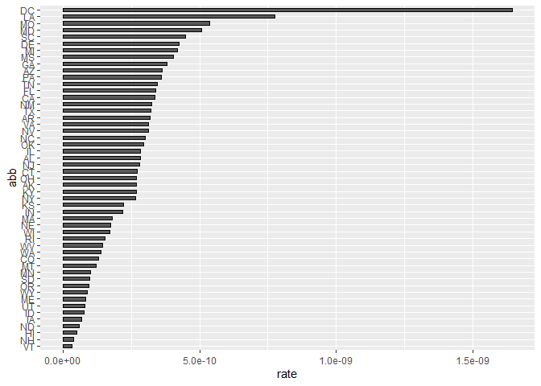

Report on Gun Murders
================
Rafael Irizarry
2021-10-19

## Introduction

This is a report on 2010 gun murder rates obtained from FBI reports. The
original data was obtained from [this Wikipedia
page](https://en.wikipedia.org/wiki/Murder_in_the_United_States_by_state).

We are going to use the following library:

``` r
library(tidyverse)
library(dslabs)
```

and load the data we already wrangled:

``` r
data(murders)
head(murders)
```

    ##        state abb region population total
    ## 1    Alabama  AL  South    4779736   135
    ## 2     Alaska  AK   West     710231    19
    ## 3    Arizona  AZ   West    6392017   232
    ## 4   Arkansas  AR  South    2915918    93
    ## 5 California  CA   West   37253956  1257
    ## 6   Colorado  CO   West    5029196    65

``` r
murders=murders %>% mutate(rate=total/population/100000)
```

## Murder rate by state

We note the large state to state variability by generating a barplot
showing the murder rate by state:

<!-- -->
